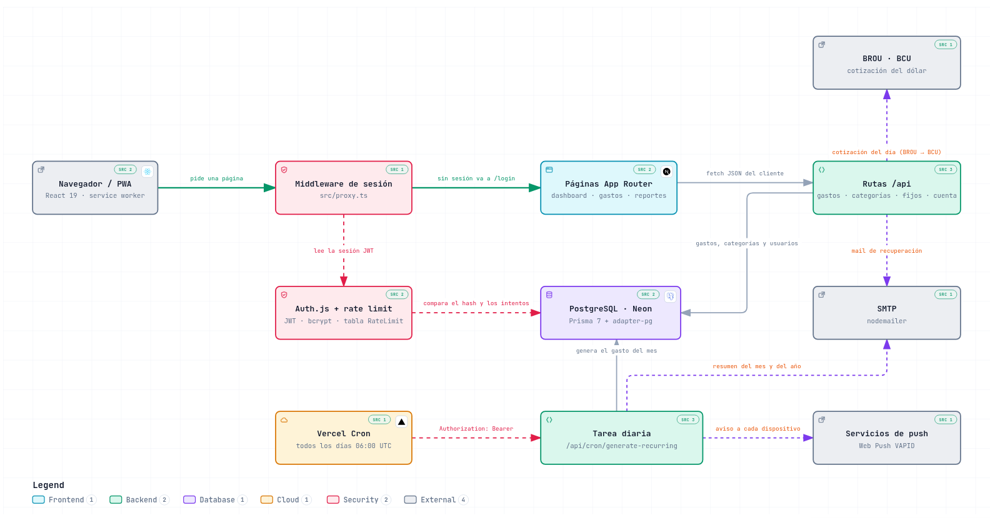

# Billions Tracker

**Tus gastos del mes, en pesos y en dólares, en un solo lugar.**

Billions Tracker es una app web para saber en qué se te va la plata cada mes. Anotás cada gasto en
pesos o en dólares, le ponés una categoría y la app arma sola los totales, los gráficos y la
comparación con los meses anteriores. Los gastos que se repiten todos los meses, como el alquiler,
internet o las cuotas de una compra, los cargás una sola vez y aparecen solos cuando corresponde.

Está pensada para Uruguay: usa la cotización del dólar del BROU, las fechas y los montos con formato
uruguayo, y funciona igual en la compu que en el celular, donde se instala como una app más.

## ¿Para qué sirve?

- **Saber cuánto llevás gastado este mes**, sin planillas ni cuentas a mano.
- **Ver en qué se va la plata**: cada gasto tiene su categoría y su color.
- **No olvidarte de los gastos fijos**: se cargan solos el día del mes que elijas.
- **Seguir las compras en cuotas** hasta la última.
- **Comparar**: este mes contra el anterior, contra el promedio y contra todo el año.
- **Recibir un resumen** el primer día de cada mes, por mail o como notificación en el celular.

## Qué podés hacer

### Inicio

Lo primero que ves al entrar: cuánto gastaste en el mes en curso, en pesos y en dólares por separado,
el total de cada categoría y tus últimos gastos. Un botón **+** te lleva directo a cargar un gasto
nuevo, y otro abre la cotización del BROU (en Android, directamente en la app del banco).

### Gastos

Cargás un gasto con el monto, la moneda (pesos o dólares), la fecha, la categoría y, si querés, una
descripción. Debajo tenés la lista de todo lo que cargaste en el mes.

Cuando un gasto es en dólares, la app guarda la cotización de ese día. Así, cuando mirás meses
pasados, las cuentas no cambian aunque el dólar haya subido o bajado desde entonces.

### Gastos fijos y en cuotas

Para lo que pagás todos los meses: alquiler, internet, el gimnasio, una suscripción. Indicás el monto
y el día del mes (del 1 al 28, para que funcione también en febrero) y la app lo agrega sola cada mes
ese día.

Si el gasto tiene fin, como una compra en cuotas, elegís el mes de la última cuota y la app te dice
cuántas cuotas son. Cuando termina, deja de cargarse. También podés pausar un gasto fijo y
reactivarlo después.

### Categorías

Cuando te registrás arrancás con siete: Alimentación, Transporte, Vivienda, Servicios, Ocio, Salud y
Otros. Podés crear las tuyas con el color que quieras, y la app te avisa si el color elegido casi no
se distingue del fondo.

### Resumen mensual

El detalle de un mes, con flechas para ir a los meses anteriores:

- Un **calendario** con los días en que gastaste; el día del gasto más grande se marca más oscuro.
- La **lista del mes**, que podés ordenar por fecha o por monto, con los gastos fijos señalados.
- **Categorías del mes**, de la que más pesa a la que menos.
- **Frente a meses anteriores**: cuánto subió o bajó el gasto contra el mes pasado y contra el
  promedio de los tres anteriores, con un gráfico de los últimos meses.
- **Qué cambió**: qué categorías subieron y cuáles bajaron frente al mes anterior.

### Resumen anual

La foto del año completo: el total gastado, un gráfico de barras mes a mes (pesos y dólares por
separado) y el total de cada categoría. Incluye además un gráfico **"todo junto"** que suma pesos y
dólares para ver qué parte del año se llevó cada mes; cada gasto en dólares se convierte con la
cotización del día en que lo cargaste.

### Conversor UYU / USD

La cotización del dólar de hoy (compra y venta) tal como la publica el BROU, con un conversor de
dólares a pesos y de pesos a dólares. Si la página del BROU no responde, la app usa la cotización
oficial del Banco Central.

### Resúmenes por mail y en el celular

El **día 1 de cada mes** te llega lo que gastaste el mes anterior, y el **1 de enero**, el resumen de
todo el año. Puede llegarte por mail, como notificación en el celular, o de las dos formas. Al tocar
la notificación se abre la app directo en ese resumen.

Las dos opciones se prenden y se apagan desde **Mi cuenta**. La notificación se activa en cada
dispositivo donde la quieras recibir.

### Mi cuenta

Desde el menú de usuario podés cambiar la contraseña, elegir cómo recibir los resúmenes y, si alguna
vez querés irte, eliminar la cuenta. Eliminarla borra para siempre todos tus gastos, categorías y
gastos fijos, y pide tu contraseña para confirmar.

## Instalala en el celular

Billions Tracker es una app web instalable: no hace falta descargarla de ninguna tienda.

- **Android (Chrome):** abrí la app, tocá el menú **⋮** y elegí **"Instalar app"** o **"Agregar a la
  pantalla principal"**.
- **iPhone (Safari):** abrí la app, tocá **Compartir** y elegí **"Agregar a inicio"**. En iPhone, las
  notificaciones solo funcionan con la app instalada de esta forma.

Queda con su propio ícono, se abre sin la barra del navegador y tiene la navegación abajo, al alcance
del pulgar.

## Tu cuenta y tus datos

- Cada persona ve únicamente sus propios gastos.
- La contraseña nunca se guarda tal cual: se guarda solo una huella (hash) que no permite
  reconstruirla, así que nadie puede leerla.
- Después de varios intentos fallidos de ingreso, la cuenta se bloquea unos minutos para frenar a
  quien intente adivinar la contraseña.
- Si te olvidás la contraseña, te llega un enlace por mail para crear una nueva. El enlace vence en
  una hora y sirve una sola vez. Usarlo también destraba una cuenta bloqueada por intentos fallidos.

## Cómo funciona por dentro

En pocas palabras:

1. **Entrar.** Cuando abrís una página, la app revisa si tenés la sesión iniciada; si no, te lleva a
   ingresar. Al iniciar sesión se compara tu contraseña con la guardada y se lleva la cuenta de los
   intentos fallidos.
2. **Usar la app.** Las pantallas leen y guardan tus gastos, categorías y gastos fijos en una base de
   datos. Cuando cargás un gasto en dólares, se consulta la cotización del día en el BROU (o en el
   Banco Central, si el BROU no responde).
3. **Mientras dormís.** Todas las madrugadas, a las 3:00 de Uruguay, se ejecuta una tarea
   automática. Esa tarea carga los gastos fijos del día y limpia datos vencidos, como los enlaces
   para recuperar contraseñas. El día 1 además manda los resúmenes por mail y a cada celular
   suscripto.

Está hecha con Next.js, TypeScript y Tailwind, guarda los datos en PostgreSQL y se publica en Vercel
con la base en Neon.

## Para desarrolladores

Cómo correrla en tu máquina, configurar el envío de mails y publicarla en Vercel + Neon:
[docs/desarrollo.md](docs/desarrollo.md).
